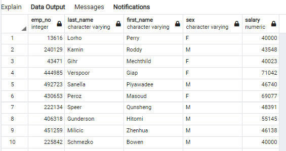
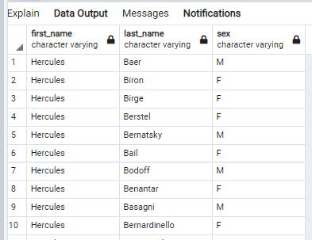

# SQL Homework - Employee Database: A Mystery in Two Parts

# Introduction
This is a research project on employees of the corporation from the 1980s and 1990s
# Overview - Data
All that remain of the database of employees from that period are six CSV files.
# Methodology
Designed tables to hold data, imported the CSVs into a SQL database for analysis.
# Analysis/Results
A query of the "employees" table shows 300,024 employee numbers

1. List the following details of each employee: employee number, last name, first name, sex, and salary.

2. List first name, last name, and hire date for employees who were hired in 1986.

3. List the manager of each department with the following information: department number, department name, the manager's employee number, last name, first name.

4. List the department of each employee with the following information: employee number, last name, first name, and department name.

5. List first name, last name, and sex for employees whose first name is "Hercules" and last names begin with "B."

6. List all employees in the Sales department, including their employee number, last name, first name, and department name.

7. List all employees in the Sales and Development departments, including their employee number, last name, first name, and department name.

8. In descending order, list the frequency count of employee last names, i.e., how many employees share each last name.
answers the questions

# Conclusions
Data used for analysis does not appear to be true. There is a large amount of people working here men and women whose first name is Hercules. Also there are 200+ occurences each of last names that are uncommon.
